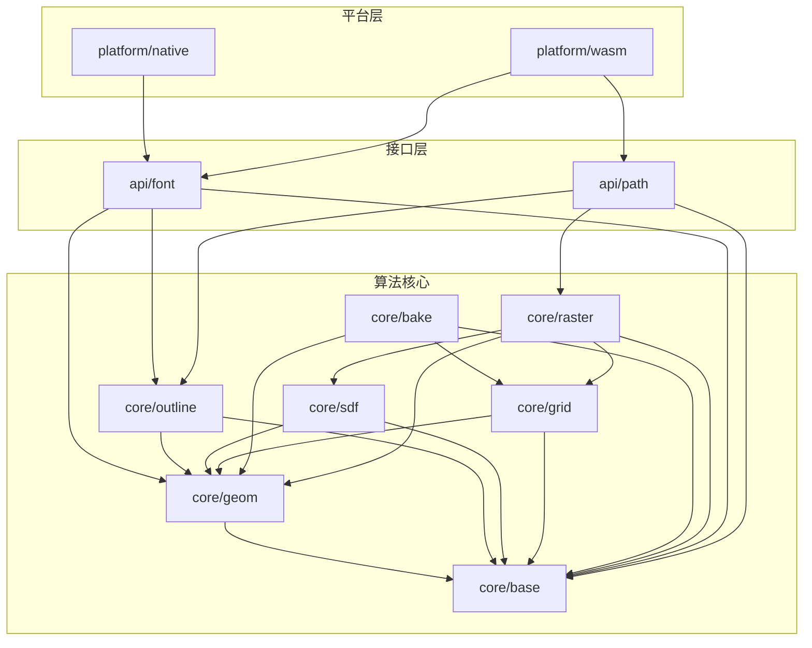

# 架构

## 概览

pi_sdf2 为单 crate，按三层组织：**算法核心**（平台无关）、**统一接口**（门面）、**平台后端**（native / wasm）。依赖严格单向：平台 → 接口 → 核心。

**硬约束：主线算法流程与各步算法保持不变**——字体/路径 → 轮廓 → 近邻弧网格 → 烘焙 → 光栅 → SDF 纹理 的顺序与计算内容不变；本轮只做模块归属重排、安全化与缺陷修复。

## 模块

### MOD-001 基础

- 目录：src/core/base/
- 职责：定义全库共用的错误类型、数值常量与容差、基础数值工具（浮点比较、无穷判定等）。
- 对外契约：D7 定义
- 依赖：无
- 不负责：具体几何运算（归 MOD-002）

### MOD-002 几何

- 目录：src/core/geom/
- 职责：提供点、向量、直线、贝塞尔曲线、弧、线段、包围盒及其运算（相交、距离、投影、细分、方向）。
- 对外契约：D7 定义
- 依赖：MOD-001
- 不负责：轮廓拓扑与绕向（归 MOD-003）；纹理编码（归 MOD-006）

### MOD-003 轮廓

- 目录：src/core/outline/
- 职责：轮廓与子轮廓的构建与遍历、绕向与方向判定；把一个子轮廓的贝塞尔段拟合为弧；描边顶点与 UV 的计算。
- 对外契约：D7 定义
- 依赖：MOD-002、MOD-001
- 不负责：字体解析（归 MOD-008）；路径动词解析（归 MOD-009）

### MOD-004 距离场

- 目录：src/core/sdf/
- 职责：给定弧集合与一个点，计算有符号距离并返回最近弧序号。
- 对外契约：D7 定义
- 依赖：MOD-002、MOD-001
- 不负责：格元划分（归 MOD-005）；纹理化（归 MOD-007）

### MOD-005 网格

- 目录：src/core/grid/
- 职责：对轮廓做递归细分，产出格元集合与每个格元的近邻弧索引。
- 对外契约：D7 定义
- 依赖：MOD-002、MOD-001
- 不负责：纹理编码（归 MOD-006）；光栅化（归 MOD-007）

### MOD-006 烘焙

- 目录：src/core/bake/
- 职责：把近邻弧网格编码为数据纹理与索引纹理（量化、去重、距离区间计算）。
- 对外契约：D7 定义
- 依赖：MOD-002、MOD-005、MOD-001
- 不负责：最终 SDF 纹理的光栅化（归 MOD-007）

### MOD-007 光栅

- 目录：src/core/raster/
- 职责：按格元采样距离场生成 SDF 纹理，并计算纹理布局（平面边界、图集边界、距离）。
- 对外契约：D7 定义
- 依赖：MOD-002、MOD-004、MOD-005、MOD-001
- 不负责：纹理编码（归 MOD-006）

### MOD-008 字体

- 目录：src/api/font/
- 职责：字体数据解析、字形索引与度量查询、字形轮廓提取。
- 对外契约：D7 定义
- 依赖：MOD-002、MOD-003、MOD-001
- 不负责：字体数据来源（文件 / 系统字体，归 MOD-010）

### MOD-009 路径

- 目录：src/api/path/
- 职责：路径动词与图元（圆、矩形、椭圆、多边形、折线）到轮廓的转换，以及 SVG 场景的 SDF 生成。
- 对外契约：D7 定义
- 依赖：MOD-002、MOD-003、MOD-007、MOD-001
- 不负责：字体字形（归 MOD-008）

### MOD-010 native 后端

- 目录：src/platform/native/
- 职责：提供 native 平台的字体数据来源（字体文件与 Windows / Android 系统字体回退）与内存分配策略。
- 对外契约：D7 定义
- 依赖：MOD-008、MOD-001
- 不负责：任何算法（全部归核心层）

### MOD-011 wasm 后端

- 目录：src/platform/wasm/
- 职责：wasm 导出边界壳（参数编解码、委托接口层）与 wasm 内存分配器。
- 对外契约：D7 定义
- 依赖：MOD-008、MOD-009、MOD-001
- 不负责：任何算法（全部归核心层）

## 存疑的边界

已由用户裁决：描边几何（顶点与 UV）**并入 MOD-003 轮廓**，不单列模块。

| 存疑的边界 | 裁决 | 影响 |
|---|---|---|
| 描边几何归属 | 并入 core/outline | MOD-003 承担两种变更原因（轮廓提取、描边），当前体量可接受 |

## 依赖方向

严格单向、无环（见概览图）。三条约束：

1. 平台层不得被接口层或核心层引用。
2. 核心层不得引用接口层或平台层。
3. 核心层不含平台条件编译、不含 unsafe（NFR-004 的机械验证面）。

## 领域实体

| 实体（TERM） | 持有模块 | 不变量 |
|---|---|---|
| TERM-001 轮廓 | MOD-003 | 每个子轮廓闭合；由弧与线段组成 |
| TERM-002 子轮廓 | MOD-003 | 闭合；绕向唯一确定内外 |
| TERM-003 弧 | MOD-002 | 曲率参数有限；曲率参数为 0 表示线段 |
| TERM-004 弧端点 | MOD-002 | 可无损转换为弧 |
| TERM-005 包围盒 | MOD-002 | mins 分量不大于 maxs 分量；空盒表示唯一 |
| TERM-006 SDF | MOD-004 | 距离符号与点的内外一致 |
| TERM-007 格元 | MOD-005 | 格元集合覆盖轮廓包围盒 |
| TERM-008 近邻弧 | MOD-005 | 对该格元内任意点，近邻弧集合足以正确计算 SDF |
| TERM-009 近邻弧网格 | MOD-005 | 每个格元的弧索引均指向有效弧 |
| TERM-010 SDF 纹理 | MOD-007 | 边长等于纹理尺寸；数值落在量化范围内 |
| TERM-011 距离像素范围 | MOD-007 | 大于 0 |
| TERM-012 纹理尺寸 | MOD-007 | 大于 0 |
| TERM-013 量化 | MOD-006 | 量化误差有界且可判定 |
| TERM-014 烘焙 | MOD-006 | 输出纹理可由索引纹理反查 |
| TERM-015 数据纹理 | MOD-006 | 每条记录可解码为弧端点 |
| TERM-016 索引纹理 | MOD-006 | 索引指向有效数据纹理位置 |
| TERM-017 单位弧 | MOD-006 | 距离区间有序 |
| TERM-018 字形 | MOD-008 | 轮廓与字体数据一致 |
| TERM-019 字形步进 | MOD-008 | 非负 |
| TERM-020 字体单位 | MOD-008 | 大于 0 |
| TERM-021 平台后端 | MOD-010、MOD-011 | 结构约束（非领域不变量）：不承载算法，由 CASE-083 承接 |
| TERM-022 算法核心 | MOD-001..MOD-007 | 结构约束（非领域不变量）：不含平台条件编译与 unsafe，由 CASE-007、CASE-064、CASE-083 承接 |
| TERM-023 边界壳 | MOD-011 | 结构约束（非领域不变量）：只做编解码与委托，由 CASE-068 承接 |

## 跨切面

| 关注点 | 归属 | 说明 |
|---|---|---|
| 错误处理 | MOD-001 | 统一错误类型；所有对外入口返回该类型（ADR-006） |
| 日志 | 各模块 | 统一使用 log crate，不单列模块 |
| 内存分配 | MOD-011 / native 默认 | wasm 分配器归 MOD-011；native 用默认分配器 |
| 边界编解码 | MOD-011 | bitcode 编解码只在边界壳（ADR-003） |
| 常量与容差 | MOD-001 | 数值容差集中定义，避免散落 |

## 关键流程

主线为线性数据依赖（字体/路径 → 轮廓 → 近邻弧网格 → 烘焙 → 光栅 → SDF 纹理），顺序由数据依赖决定，不另画图（见概览图与各模块职责）。**该流程与各步算法在本轮保持不变。**

## 自检

- [x] 每个 MOD 都有对应目录路径，路径之间无冲突
- [x] 依赖图无环（沿图走查一遍确认）
- [x] 依赖图使用 flowchart 语法，未使用 C4Context
- [x] 关键流程未为好看而画（主线为线性依赖，已说明）
- [x] 每个 MOD 的职责描述「负责什么」，不是「怎么做」
- [x] 每条 REQ 均可归属到 MOD（见下）
- [x] 领域实体不变量已写出且可验证
- [x] 领域实体表按 TERM ID 引用，未复述 D3 定义、未编新词
- [x] 跨切面有明确归属，无「各处自己处理」
- [x] 只展开了影响架构目标的模块
- [x] 每个模块过了五条拆分判据
- [x] 拆不动处已分类（描边归属经用户裁决为架构取舍）
- [x] 未把控制流切点当模块边界
- [x] 00-index 的 targets 已更新，已与其他设计比对无冲突
- [x] 每个 MOD 在 00-index 的「模块」表占一行，目录列与 targets 一致

REQ → MOD 归属：

| REQ | 归属 MOD |
|---|---|
| REQ-001 | MOD-002、MOD-003、MOD-004、MOD-005、MOD-006、MOD-007、MOD-008、MOD-009 |
| REQ-002 | MOD-008、MOD-009、MOD-010、MOD-011 |
| REQ-003 | 全部（结构约束） |
| REQ-004 | MOD-001、MOD-008、MOD-011 |
| REQ-005 | MOD-002、MOD-003、MOD-004、MOD-006 |
| REQ-006 | MOD-011 |
