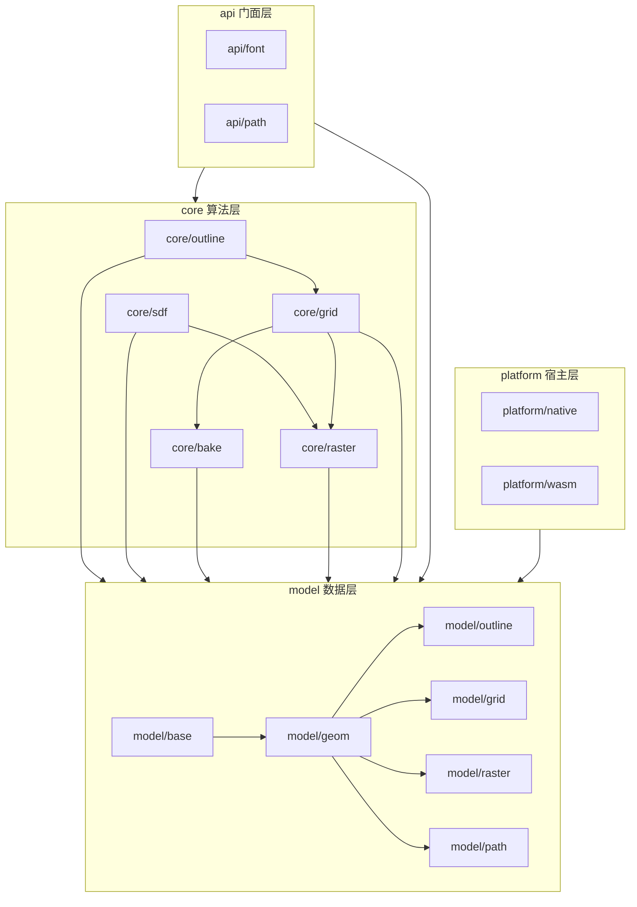

# 架构

## 概览

pi_sdf2 为单 crate，按四层组织：**model（数据）**、**core（算法）**、**api（门面）**、**platform（宿主服务）**。

划分判据：**「数据的定义与它自身的内蕴运算」进 model；「跨数据、成流程的算法」进 core**。例如弧的半径与「点到弧的距离」是 model::Arc 的方法；「贝塞尔拟合为弧序列」是 core::outline 的算法。

**硬约束：主线算法流程与各步算法保持不变**——字体/路径 → 轮廓 → 近邻弧网格 → 烘焙 → 光栅 → SDF 纹理 的顺序与计算内容不变；本轮只做分层重排、安全化与缺陷修复。

**导出注解**：native 与 wasm 共用同一份类型定义，导出注解 `cfg_attr(target_arch = "wasm32", wasm_bindgen)` 只允许出现在 **model** 与 **api** 两层（native 下不生效）；core 与 platform 一律禁止。

## 模块

### MOD-001 model::geom

- 目录：src/model/geom/
- 职责：定义点、向量、有符号向量、直线、线段、贝塞尔曲线、弧、包围盒，以及它们自身的内蕴几何运算（距离、投影、切线、包围盒、方向）。
- 依赖：MOD-006
- 不负责：跨数据的算法（拟合、采样、细分归 core）

### MOD-002 model::outline

- 目录：src/model/outline/
- 职责：定义子轮廓与轮廓，以及轮廓自身的内蕴运算（遍历、绕向、反转、包围盒）。
- 依赖：MOD-001、MOD-006
- 不负责：弧拟合与描边几何（归 MOD-007）

### MOD-003 model::grid

- 目录：src/model/grid/
- 职责：定义格元与近邻弧网格及其内蕴运算（索引校验、覆盖范围）。
- 依赖：MOD-001、MOD-006
- 不负责：细分算法（归 MOD-009）

### MOD-004 model::raster

- 目录：src/model/raster/
- 职责：定义 SDF 纹理、纹理定位信息、纹理布局、单位弧、数据纹理、索引纹理。
- 依赖：MOD-001、MOD-006
- 不负责：编码与光栅化算法（归 MOD-010、MOD-011）

### MOD-005 model::path

- 目录：src/model/path/
- 职责：定义路径动词、路径、图形元（圆/矩形/椭圆/多边形/折线/线段）及其内蕴运算（包围盒、闭合判定、图元自检）。
- 依赖：MOD-001、MOD-006
- 不负责：路径到轮廓的算法（归 MOD-013）

### MOD-006 model::base

- 目录：src/model/base/
- 职责：定义统一错误类型、数值常量与容差、基础数值工具。
- 依赖：无
- 不负责：任何几何与算法

### MOD-007 core::outline

- 目录：src/core/outline/
- 职责：把一个子轮廓的贝塞尔段拟合为弧；描边顶点与 UV 计算。
- 依赖：MOD-002、MOD-001、MOD-006
- 不负责：轮廓数据本身（归 MOD-002）；细分（归 MOD-009）

### MOD-008 core::sdf

- 目录：src/core/sdf/
- 职责：给定弧集合与一个点，计算有符号距离并返回最近弧序号。
- 依赖：MOD-001、MOD-006
- 不负责：格元划分（归 MOD-009）；纹理化（归 MOD-011）

### MOD-009 core::grid

- 目录：src/core/grid/
- 职责：对轮廓做递归细分，产出格元集合与每格元的近邻弧索引。
- 依赖：MOD-003、MOD-002、MOD-001、MOD-006
- 不负责：纹理编码（归 MOD-010）；光栅化（归 MOD-011）

### MOD-010 core::bake

- 目录：src/core/bake/
- 职责：以索引 arena 共享单位弧，并把网格编码为数据纹理与索引纹理（量化、去重、距离区间）。
- 依赖：MOD-004、MOD-003、MOD-001、MOD-006
- 不负责：最终 SDF 纹理的光栅化（归 MOD-011）

### MOD-011 core::raster

- 目录：src/core/raster/
- 职责：计算纹理布局，并按格元采样距离场生成 SDF 纹理。
- 依赖：MOD-008、MOD-009、MOD-004、MOD-001、MOD-006
- 不负责：纹理编码（归 MOD-010）

### MOD-012 api::font

- 目录：src/api/font/
- 职责：字体解析与状态持有（FontFace）、字形度量、字形轮廓提取入口。
- 依赖：MOD-007、MOD-002、MOD-001、MOD-006
- 不负责：字体数据来源（归 MOD-014）

### MOD-013 api::path

- 目录：src/api/path/
- 职责：路径/图形元到轮廓的转换入口、SVG 场景管理、端到端入口函数（含字节通道与 wasm 调试入口）。
- 依赖：MOD-007、MOD-011、MOD-005、MOD-002、MOD-001、MOD-006
- 不负责：字体字形（归 MOD-012）

### MOD-014 platform::native

- 目录：src/platform/native/
- 职责：提供 native 平台的字体数据来源（字体文件与 Windows / Android 系统字体回退）。
- 依赖：MOD-006
- 不负责：算法与导出（本层不投影到 JS）

### MOD-015 platform::wasm

- 目录：src/platform/wasm/
- 职责：提供 wasm 目标的内存分配器。
- 依赖：无
- 不负责：导出投影（归 model 与 api 的注解）

## 边界类型清单

本清单回答「哪些类型出现在跨语言边界上、由哪一层承载」。它是导出面的权威，防止再出现「导出面被写窄」。

| 类型 | 归属 | 投影形态 |
|---|---|---|
| Point、Vector、SignedVector、Line、Segment、Bezier、Arc、Aabb | MOD-001 | 导出为 JS 类 |
| Contour、Outline | MOD-002 | 导出为 JS 类 |
| Cell、CellGrid | MOD-003 | 导出为 JS 类 |
| SdfTexture、TextureInfo、TextureLayout、UnitArc、DataTexture、IndexTexture | MOD-004 | 导出为 JS 类 |
| PathVerb、Path、Shape | MOD-005 | PathVerb 直接导出；Path 导出为类；Shape 为 opaque 类 + 静态构造器 |
| Error | MOD-006 | 实现 Into<JsValue>，作为 Result 的 Err 跨边界 |
| FontFace、GlyphMetrics | MOD-012 | 导出为 JS 类 |
| SvgScene | MOD-013 | 导出为 JS 类 |
| get_char_arc_debug、compute_svg_debug、brotli_decompressor | MOD-013 | 导出为函数 |
| 内存分配器、字体来源 | MOD-014、MOD-015 | 不投影（宿主内部能力） |

## 存疑的边界

已由用户裁决：描边几何（顶点与 UV）归 **MOD-007 core::outline**，不单列模块。

| 存疑的边界 | 裁决 | 影响 |
|---|---|---|
| 描边几何归属 | 归 core::outline | MOD-007 承担两种变更原因（弧拟合、描边），当前体量可接受 |
| 数据与算法的分界 | 内蕴运算随数据进 model，跨数据算法进 core | 「内蕴」判据：只用到自身字段与同层类型 |

## 依赖方向

严格单向、无环（见概览图）。四条约束：

1. **model** 不得依赖 core / api / platform。
2. **core** 不得依赖 api / platform；不得出现平台行为分支与 unsafe。
3. **api** 不得依赖 platform。
4. **导出注解**只允许出现在 model 与 api。

## 领域实体

| 实体（TERM） | 持有模块 | 不变量 |
|---|---|---|
| TERM-001 轮廓 | MOD-002 | 每个子轮廓闭合时首尾弧端点相接；闭合性在反转后不变 |
| TERM-002 子轮廓 | MOD-002 | 闭合；绕向唯一确定内外 |
| TERM-003 弧 | MOD-001 | 曲率参数有限；曲率参数为 0 表示线段 |
| TERM-004 弧端点 | MOD-001 | 可无损转换为弧 |
| TERM-005 包围盒 | MOD-001 | mins 分量不大于 maxs 分量；空盒表示唯一（两分量都判） |
| TERM-006 SDF | MOD-008 | 距离符号与点的内外一致 |
| TERM-007 格元 | MOD-003 | 格元集合覆盖轮廓包围盒 |
| TERM-008 近邻弧 | MOD-009 | 对该格元内任意点，近邻弧集合足以正确计算 SDF |
| TERM-009 近邻弧网格 | MOD-003 | 每个格元的弧索引均指向有效弧 |
| TERM-010 SDF 纹理 | MOD-004 | 边长等于纹理尺寸；数值落在量化范围内 |
| TERM-011 距离像素范围 | MOD-004 | 大于 0 |
| TERM-012 纹理尺寸 | MOD-004 | 大于 0 |
| TERM-013 量化 | MOD-010 | 量化误差有界且可判定 |
| TERM-014 烘焙 | MOD-010 | 输出纹理可由索引纹理反查 |
| TERM-015 数据纹理 | MOD-004 | 每条记录可解码为弧端点 |
| TERM-016 索引纹理 | MOD-004 | 索引指向有效数据纹理位置 |
| TERM-017 单位弧 | MOD-004 | 距离区间有序 |
| TERM-018 字形 | MOD-012 | 轮廓与字体数据一致 |
| TERM-019 字形步进 | MOD-012 | 非负 |
| TERM-020 字体单位 | MOD-012 | 大于 0 |
| TERM-021 平台后端 | MOD-014、MOD-015 | 结构约束（非领域不变量）：不承载算法 |
| TERM-022 算法核心 | MOD-007..MOD-011 | 结构约束（非领域不变量）：不含平台行为分支与 unsafe |
| TERM-023 导出投影 | MOD-001..MOD-013 | 结构约束（非领域不变量）：只做类型投影与入口转发，不含算法 |

## 跨切面

| 关注点 | 归属 | 说明 |
|---|---|---|
| 错误处理 | MOD-006 | 统一错误类型；所有对外入口返回该类型（ADR-006） |
| 日志 | 各模块 | 统一使用 log crate，不单列模块 |
| 内存分配 | MOD-015 / native 默认 | wasm 分配器归 MOD-015；native 用默认分配器 |
| 边界编解码 | MOD-013 | 字节通道的编解码（ADR-003 保持）；类型投影为主 |
| 常量与容差 | MOD-006 | 数值容差集中定义 |

## 关键流程

主线为线性数据依赖（字体/路径 → 轮廓 → 近邻弧网格 → 烘焙 → 光栅 → SDF 纹理），顺序由数据依赖决定，不另画图。**该流程与各步算法在本轮保持不变。**

## 自检

- [x] 每个 MOD 都有对应目录路径，路径之间无冲突
- [x] 依赖图无环
- [x] 依赖图使用 flowchart 语法，未使用 C4Context
- [x] 关键流程未为好看而画
- [x] 每个 MOD 的职责描述「负责什么」，不是「怎么做」
- [x] 每条 REQ 均可归属到 MOD
- [x] 领域实体不变量已写出且可验证
- [x] 领域实体表按 TERM ID 引用
- [x] 跨切面有明确归属
- [x] 每个模块过了五条拆分判据
- [x] 拆不动处已分类（描边归属经用户裁决）
- [x] 未把控制流切点当模块边界
- [x] 新增「边界类型清单」，覆盖全部跨语言类型（补上轮缺口）
- [x] 00-index 的 targets 已更新，与其他设计无冲突
- [x] 每个 MOD 在 00-index 的「模块」表占一行

REQ → MOD 归属：

| REQ | 归属 MOD |
|---|---|
| REQ-001.1 | MOD-001、002、007、008、009、010、011、012、013 |
| REQ-001.2 | MOD-001、003、004、009、010、011 |
| REQ-001.3 | MOD-004、008、010、011 |
| REQ-001.4 | MOD-004、005、011、013 |
| REQ-002.1 | MOD-012、014 |
| REQ-002.2 | MOD-001..013（导出注解） |
| REQ-002.3 | MOD-001、002、012 |
| REQ-003.1 | MOD-007..011、014、015 |
| REQ-003.2、REQ-003.3 | 全部（结构约束） |
| REQ-004.1 | MOD-006、013 |
| REQ-004.2 | MOD-006、012、014 |
| REQ-004.3 | MOD-001、005、006、013 |
| REQ-005.1 | MOD-006、009、010 |
| REQ-005.2、REQ-005.3、REQ-005.4 | MOD-001、002、008 |
| REQ-006.1 | MOD-013 |
