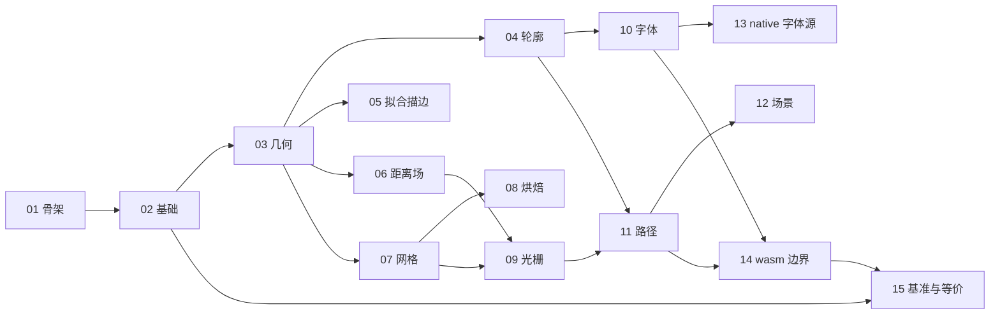

# 任务图

## 目标

全部完成后，pi_sdf2 可在 Windows / Android / wasm32 三目标编译，并通过同一套接口产出与 pi_sdf 等价的轮廓、近邻弧网格与 SDF 纹理；算法层零 unsafe、不可信输入不崩溃，性能不劣于基线。

## 前沿

- [ ] TASK-01 工程骨架与构建

## 按目录

| 目录 | 任务 |
|---|---|
| 根（Cargo.toml / build/） | TASK-01、TASK-15 |
| `src/lib.rs` | TASK-01、TASK-15 |
| `src/core/`（mod.rs、consts.rs、num.rs） | TASK-01 |
| `src/api/`、`src/platform/`（mod.rs） | TASK-01 |
| `src/core/base/` | TASK-01、TASK-02 |
| `src/core/geom/` | TASK-03 |
| `src/core/outline/` | TASK-04、TASK-05 |
| `src/core/sdf/` | TASK-06 |
| `src/core/grid/` | TASK-07 |
| `src/core/bake/` | TASK-08 |
| `src/core/raster/` | TASK-09 |
| `src/api/font/` | TASK-10 |
| `src/api/path/` | TASK-11、TASK-12 |
| `src/platform/native/` | TASK-13 |
| `src/platform/wasm/` | TASK-01、TASK-14 |
| `tests/` | TASK-01..TASK-15 |
| `benches/`、`examples/`、`wasm/` | TASK-14、TASK-15 |

## 依赖图

## 文件碰撞

| 文件 | 冲突的任务 | 处理 |
|---|---|---|
| （无） | — | 当前前沿只有 TASK-01，无交集 |

## 决策摘要

（任务完成后逐行补记）

## 尚未成形

- wasm 前端的可视化调试页具体交互形态未定（需要实际跑起来才能定）——范围内，已登记为 `Deferred`，归属 TASK-14。

## 明确不做

- blur / 外发光几何：本轮范围外（Non-Goal）。
- svg.rs 死模块：本轮范围外（Non-Goal）。
- Linux / macOS 支持：本轮范围外（Non-Goal）。

## 自检

- [x] 每个任务是一条垂直切片（`_inner` + `tests/` 同任务），可独立验证
- [x] `触及` 的目录跨度证明垂直切片（src 与 tests 同现），未挤在同一层
- [x] ★ 每个任务的 `触及` 与 `阻塞于` 都写了，无留空
- [x] 所有 `触及` 路径都在 00-index 的 targets 范围内
- [x] ★ `触及` 里没有冻结文件（对照 D6「冻结面」表逐条核对，仅出现 `_inner` 与豁免文件）
- [x] ★ 任务描述写明测试打冻结的 `xx` 这一层，不直接调 `xx_inner`
- [x] 每个任务的关联引用到子需求粒度（如 REQ-005.2）
- [x] 每个任务能塞进一个空上下文窗口
- [x] 无膨胀型重构任务（本设计为新建库的逐模块切片）
- [x] 「目标」已写
- [x] 前沿已算出：TASK-01
- [x] 「按目录」表已填，每个路径都归得进某个模块目录
- [x] ★ 前沿任务之间 `触及` 无交集（当前前沿仅 TASK-01）
- [x] 「尚未成形」项确实未锐利到可写成任务
- [x] 依赖图无环
- [x] 每条 REQ（001–006）至少被一个任务覆盖
- [x] 每个 TASK-NN 都在 00-index「任务」表占一行，`阻塞于` 与任务文件一致
